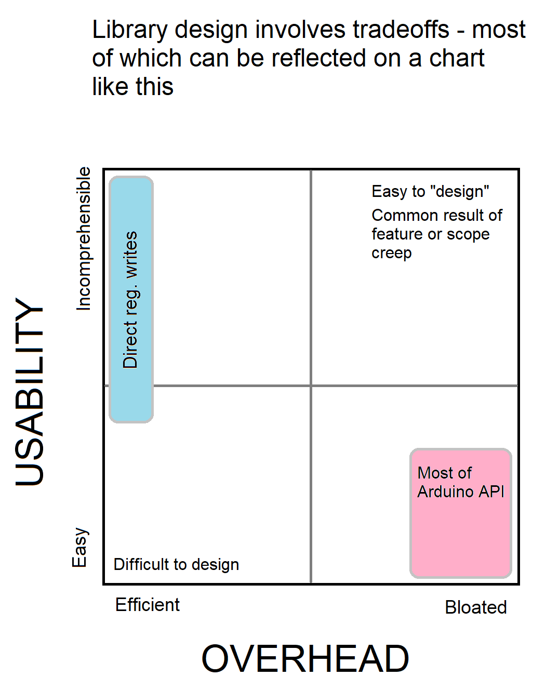

# Designing Libraries
Designing libraries presents a number of particular challenges. Of particular importance is careful design to ensure that it is easier to use than simple regiser manipulation. If your library doesn't make something easier than direct register manipulation, nobody will have reason to use it. At the same time, you must be very cognizent of ovehead. Overhead can usually be calculated with a formula something like this, (with different constants for RAM and Flash):
```text
Overhead = C + B (when only a single instance of peripheral being used or a C++ class based library for an external device)
Overhead = C + A*(instances of peripheral) = applicable to libraries like Logoc, Comparator, and such
Overhead = A + B + C + D... (for C library; eacj term representing one of the functions it provides.
```

If the library is for interfacing with external hardware, 

So you need to give most thought relating to overhead to the smallest flash parts that you want to be able to use your library, and to the parts with the most instances of the peripherals in question, and to the impact of moving from parts with 1 of a peripheral, to those with multiple. 




In the above diagram, for each specfic API function (for the Ardino API example), one could place a dot at a very specific point. likewise, for direct register writess, depeding on the peripheral, it may be straightforward to configure them by hand, or truly nightmarish. 

Any library, in order for users to adopt it, must be closer to the bottom of the chart or people will just use the maximally efficient, easier, register writes. A librar that fails this test should not be written nor used.

The challenge is how to stay in the lower left quadrant, withtout sacrificing flexibility - one could really extend this along the Z axis to cover functionality. Writing a simple, efficient library that uses a very powerful peripheral to do something very simple is far less of am accomplishment than one which is simple, efficient and exposes the true power of the peripheral or device in question/ 


## The danger of "Creep"
Once a library has been designed and released, if it is successful people will inevitably start asking for more features. Many of them will have a clear motivation which tempts one to implement them. You must here be merciles if you wish to stay in the lower left quadrant; every feature added nudges you upwards and to the right. There is often very little correlation between the size of the benefit, and cost in bloat or usability. For example, consider Adafruit_Neopixel vs tinyNeopixel and tinyNeoPixel_Static. The Adafruit library adds bloat to suppot 400khz LEDs, which are basically non-existent in the market today - but the cost is non-zero. It also permits the resizing of the sring at runtime - this feature, only marginally useful, comes at a massive cost.

Be especially skeptical of requests for support for external devices similar to the original targets, but which could just as well be implemented as a separate library. This is "Scope Creep" and it has left many libraries as incoherent monstrosities. While it can be done well - probably with one header that enforces a uniform API for universal functions), this needsto be considered from the earliest stages of planning, and in those cases we would not desribe it as "creep".

A closely related phenomonon is "platform creep" where a library originally desgined for AVR is extended to support ESP8266, and then SAMD, and then STM32, and next thing you know, there is a tangle of #ifdefs that make maintenance difficult, unequal treatment of platforms, and further negative conseqences. Radiohead and FastLED suffer dearly from both of these.

### How to get platform support wrong
These antipatterns are exremely common, and their consequences for the library are often disastrous. 
#### Testing for specfic parts
So you added support for the ATmega4809 to your library, and you needed some #if macros to do so. The worst way to do this is `#ifdef __AVR_ATmega9-4809__` = because the same code you wrote will almost certainly work of a any membmer of the 0-series, and quite possiblly any AVR device released after 2016 (if your changes in this example only relateed to manipulating pins, this is the case). Often changing a test like that to `#if __AVR_ARCH__ > 100` will with a trivial change add support for dozens of parts instead of a singke part! 
#### Making assumptions about the mapping of pin numbers to ports
Just say no. There are so many libraries that ae locked to a small number of parts because of adhoc handling of the nmbering of the pins on a specific board. Especoall in the case of official Ardino boards, where pin mapping design decisions tend towards maximum perversity, this is particularly tempting - and particlarly destructive. 
