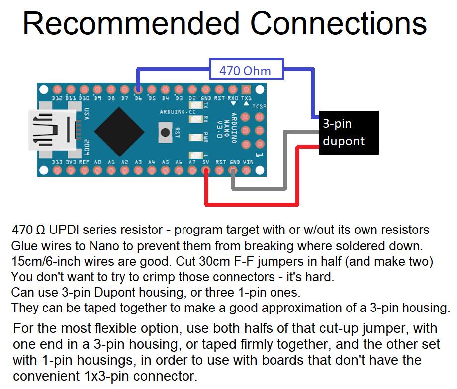

# Step-by-step guide to turn a uno/nano/pro mini into a UPDI programmer

The tinyAVR 0/1/2-series, megaAVR 0-series, and AVR Dx-series parts are programmed through the Unified Program and Debug Interface (UPDI). This is a 1-wire interface using the UPDI pin on the AVR Dx-series part. A UPDI programmer is required to to change the fuses ("burn bootloader"), upload a bootloader (if desired) and upload sketches if a bootloader is not in use. The classic ISP programmers cannot be used - only UPDI can be used to program these parts.

There are two very easy ways to get UPDI programming for $3 or less. As of DxCore 1.3.0 and megaTinyCore 2.2.6, it is now possible to use a serial adapter and 4.7k resistor!
Serial adapter as UPDI programmer -
Connections:
* Vcc, Gnd of serial adapter to Vcc, Gnd of target
* 4.7k resistor between Tx and Rx of adapter (many adapters have built-in 1k, 1.5k, or 2.2k resistor in series with Tx; these should use a proportionally smaller resistor)
* Rx of adapter to UPDI pin of target. A small resistor (under 1k - like the 470 ohm one we generally recommend) in series with this is fine.

Choose "Serial Port and 4.7k" from the Tools -> Programmer menu, and select the Serial Port from the Tools -> Port menu.

Note that this does not give you serial monitor - you need to connect a serial adapter the normal way for that (I suggest using two, along with an external serial terminal application). This technique works with those $1 CH340 serial adapters from ebay, aliexpress, etc. Did you accidentally buy some that didn't have a DTR pin broken out, and so weren't very useful with the Pro Minis you hoped to use them with?

The more traditional route is the one described here.

An Arduino sketch is available to turn ATmega328(p)-based Arduino’s, like the Arduino UNO and Nano, into an UPDI programmer (it does not work on boards based on other parts, like the 32u4 (Micro/Leo) or any non-AVR board). The following steps show how to make one of these low cost UPDI programmers. We recommend using an Arduino Nano or Pro Mini (a cheap clone from ebay is fine) and hard-wiring it for the task.

## Part 1: Upload the sketch to your Arduino
1.	The UPDI programmer sketch can be found here: https://github.com/SpenceKonde/jtag2updi
Download and extract, or clone the repo to your local machine.
2.	Browse to the download location and open the jtag2updi folder
3.	Open the sketch jtag2updi.ino and upload it to your Arduino. The .ino file itself is empty, and this is fine - all the code is contained in other files in the same folder, but the empty .ino is needed so that the IDE can compile it.

## Part 2: Connect hardware
*previous versions of this guide specified a cap between reset and ground after programming. Testing has revealed this to be unnecessary*
1.  Connect Ground of Arduino to Ground of the ATTiny
2.  Connect Pin 6 of the Arduino to the UPDI pin of the ATTiny - if using the bare chip, connect it via a [470 ohm resistor](https://github.com/SpenceKonde/AVR-Best-Practices/blob/master/HardwareNotes/UPDISeriesResistors.md). Many breakout boards will provide a separate UPDI pin that has this resistor built-in; in this case, this pin may be connected directly to the programming pin.
3.	Unless the ATtiny has it's own power supply, connect 5v pin of the Arduino to the Vcc pin of the ATtiny

Now, you should be able to select an ATtiny megaAVR series board from Tools -> Board, and upload a sketch via the IDE. The same programmer can also be used to Burn Bootloader (be sure to select the jtag2updi (megaTinyCore) programmer from Tools -> Programmer menu)

**If the process appears to hang at the start of the upload, press and release the reset button on the UPDI prpgrammer** I pounded on jtag2updi for like a month trying to get rid of all the bugs like this, and after finally getting my fixes merged in, discovered that somehow, this could still happen.

### Ignore the warning about "flash" and "boot" memories
A warning will be shown during the upload process `avrdude: jtagmkII_initialize(): Cannot locate "flash" and "boot" memories in description` - this warning is spurious and can be safely ignored.

## Permanent programmer assembly suggestions:
* For convenience, we recommend dedicating a Nano or Pro Mini to this purpose, and soldering the connections. Nano and Pro Mini clones can be had on ebay for $2-5 shipped. Use one without the headers pre-installed.
* Solder the wires in place - we suggest using 0.1" DuPont jumpers: Cut the jumpers in half, strip, and solder in place.
* After soldering the wires in place, glue them to the bottom of the board with hot-melt glue, otherwise they will fatigue and break easily with handling.
* We suggest arranging the connectors in the following order: UPDI, GND, Vcc - this way, if you attach the connector backwards, no harm is done. Use a 3-pin DuPont housing, or hold three 1-pin housings in together with scotch tape.

## Bootloaders and "Burn Bootloader"
"Burn Bootloader does three things - it sets the fuses to match the options selected in the Tools submenus (options controlled by fuses are marked in the menu), erases the flash, and writes the bootloader to the flash, if you have selected a board definition with a bootloader (the ones marked with (Optiboot) in the board menu).

If you wish to stop using the bootloader after having installed it and go back to uploading via UPDI, choose the "no bootloader" board option, and "burn bootloader" to set the fuses appropriately. When in doubt, there is never harm in burning the bootloader - unlike classic AVRs, you cannot brick the board by "burning bootloader" with improper settings!

## Troubleshooting

### Ignore the warning about "flash" and "boot" memories
A warning will be shown during the upload process `avrdude: jtagmkII_initialize(): Cannot locate "flash" and "boot" memories in description` - this warning is spurious (a bug in avrdude, or in the modifications made to support jtag2updi). It can and should be ignored - it is shown whenever uploading via jtag2updi

### Use Verbose uploads
The avrdude output is very terse by default, particularly with jtag2updi. Enabling verbose upload ensures that you get useful feedback during the upload (and bootloading process)

## Photographs

### Nano as UPDI programmer, assembly and use
 "Nano converted to UPDI programmer")

### Pro Mini (and serial adapter) as UPDI
(megaavr/extras/ProMiniAsUPDI.png["Pro Mini converted to UPDI programmer")
### Typical development configuration
Since it is frequently useful to have a serial port for debugging, I typically find myself using a configuration like this, with a serial adapter and UPDI programmer connected simultaneously. Obviously, one could also use Optiboot, but without disabling UPDI to get reset, or using other awkward tricks (see [AlternativeReset. So

